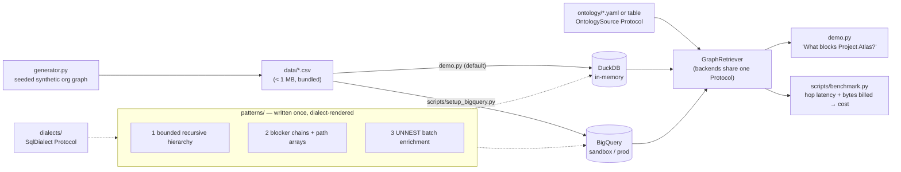

# graph-rag-sql

> Graph traversal for RAG **without a graph database** — recursive-CTE patterns on a SQL warehouse, inspired by a public engineering write-up on graph-DB-to-warehouse migrations.

Answers questions like **"What blocks Project Atlas?"** — with the full dependency *path*, not just the endpoints — using nothing but `WITH RECURSIVE` SQL on the same warehouse that already holds your data. Runs locally on DuckDB in seconds (zero cloud setup), and on BigQuery for the production path.

---

## The problem

RAG over organizational data needs two retrieval shapes:

1. **"Find things like X"** → vector search. Solved.
2. **"What blocks X?" / "Who owns the thing that blocks X?"** → relationship traversal. The standard answer is a dedicated graph database next to your vector store.

That standard answer has a hidden cost: **two storage systems that must agree**. Sync delays between them produce stale relationship data that surfaces to users as apparent hallucination — the model faithfully reports an edge that no longer exists. You now debug consistency instead of shipping features.

## The bet

For **bounded traversals (3–5 hops)** over data that already lives in a warehouse, you don't need a graph database at all. Recursive CTEs give you hierarchy walks, dependency chains, and batch enrichment in plain SQL — with **atomic consistency for free**, because the graph *is* the warehouse tables.

A public engineering post — [Why We Traded a Graph Database for BigQuery CTEs](https://www.latentview.com/blog/why-we-traded-a-graph-database-for-bigquery-ctes/) — describes this trade-off playing out in production, with a managed graph database replaced at roughly **94% lower cost (~$50/year vs ~$800/month)** and end-to-end latency dominated by LLM generation, not retrieval.

**This repo is an independent implementation of that general idea** — built from scratch on a fully synthetic dataset, with its own schema, query design, and API. It isn't a copy or sanitized export of any production codebase; it's my own take on the "recursive CTEs instead of a graph DB" pattern, written to explore the approach and to have a clean, reusable reference implementation.

## The three patterns

Each pattern lives in [`src/graph_rag/patterns/`](src/graph_rag/patterns/) as a documented module that renders dialect-specific SQL (DuckDB and BigQuery).

### ① Bounded recursive hierarchy

Walk `belongs_to` edges up (ancestors) or down (subtree), depth-capped so cycles and fan-out can't hurt you.

```sql
WITH RECURSIVE children AS (
 SELECT e.entity_id, e.name, e.type, e.status, 0 AS depth
 FROM canonical_entities e WHERE e.entity_id = @entity_id
 UNION ALL
 SELECT e.entity_id, e.name, e.type, e.status, c.depth + 1
 FROM children c
 JOIN entity_relationships r
 ON r.target_entity_id = c.entity_id AND r.relationship_type = 'belongs_to'
 JOIN canonical_entities e ON e.entity_id = r.source_entity_id
 WHERE c.depth < 3 -- the bound is what makes this viable
)
SELECT * FROM children WHERE depth > 0;
```

```python
retriever.get_hierarchy("proj-atlas", direction="down")
```

### ② Blocker chains with path arrays (the showcase)

Follow `blocks` / `depends_on` edges transitively while **collecting the traversal path in arrays** — so the answer isn't "these 4 things block Atlas" but *how* each one blocks it.

```sql
WITH RECURSIVE blocker_chain AS (
 SELECT e.entity_id, e.name, e.status, 1 AS distance,
 [r.relationship_type] AS rel_chain,
 [e.name] AS name_chain
 FROM entity_relationships r
 JOIN canonical_entities e ON e.entity_id = r.source_entity_id
 WHERE r.target_entity_id = @entity_id
 AND r.relationship_type IN UNNEST(@rel_types)
 UNION ALL
 SELECT e.entity_id, e.name, e.status, bc.distance + 1,
 ARRAY_CONCAT(bc.rel_chain, [r.relationship_type]),
 ARRAY_CONCAT(bc.name_chain, [e.name])
 FROM blocker_chain bc
 JOIN entity_relationships r ON r.target_entity_id = bc.entity_id
 JOIN canonical_entities e ON e.entity_id = r.source_entity_id
 WHERE bc.distance < @max_depth
 AND r.relationship_type IN UNNEST(@rel_types)
)
SELECT * FROM blocker_chain
QUALIFY ROW_NUMBER() OVER (PARTITION BY entity_id, distance ORDER BY name) = 1
ORDER BY distance LIMIT 50;
```

```python
retriever.find_blockers("proj-atlas", max_depth=5)
```

Two details worth noticing: relationship types travel as an **array query parameter** (`IN UNNEST(@rel_types)`) — never string-interpolated into SQL — and dedup happens via `QUALIFY` on scalar columns because BigQuery doesn't allow `SELECT DISTINCT` over ARRAY columns.

### ③ Batch enrichment via UNNEST (killing N+1)

After vector search returns your top-k entities, enrich **all of them in one query** — parents, blockers, risks, owners as `ARRAY_AGG(STRUCT(...))` groups seeded by `IN UNNEST(@entity_ids)` — instead of 4×k point lookups.

```python
retriever.enrich_batch(["proj-atlas", "proj-nimbus", "goal-fy26-revenue"])
# → {entity_id: EnrichmentResult(parents=[...], blockers=[...], risks=[...], owners=[...])}
```

## Bring your own ontology

The graph vocabulary is **data, not code**. A pydantic-validated registry declares your entity
types, relationship types, their direction, which ones may recurse, per-type depth caps, and
semantic aliases:

```yaml
# ontology/org_graph.yaml (excerpt)
relationship_types:
  - name: depends_on
    description: The source cannot finish until the target does.
    source_types: [Task, Project]
    target_types: [Task, Project]
    inverse: blocks
    traversal: transitive          # may recurse; `terminal` types are enrichment-only
    canonical_direction: target_to_source
    max_depth: 5                   # per-type blast-radius cap

semantics:
  upstream:  [blocks, depends_on]  # callers ask for a MEANING, not a column value
  hierarchy: [belongs_to]
```

Pattern modules never see a type name. The backend resolves a semantic to a concrete list and
passes it as an array query parameter, so `patterns/` contains no domain literals and no table
names — those come from the registry's `table_config` too.

**Adapting to a different domain is two views and one YAML file — no Python changes.** Expose
your own tables in the shape the registry declares:

```sql
CREATE VIEW graph_nodes AS
  SELECT id AS node_id, subject AS name, 'Incident' AS node_type, state AS status FROM incidents
  UNION ALL SELECT id, name, 'Service', status FROM services;

CREATE VIEW graph_edges AS
  SELECT cause_id AS src_id, effect_id AS dst_id, 'caused_by' AS edge_type FROM incident_links;
```

```python
ontology  = FileOntologySource("my_domain.yaml").load()
retriever = GraphRetriever(backend, ontology=ontology)
retriever.traverse("svc-checkout", semantic="upstream", max_depth=2)
```

This is **verified, not asserted**: `tests/test_conformance.py` runs all three patterns against
a second ontology (Service / Incident / Team) that shares no type names with the demo graph,
with zero changes to any pattern module.

The registry can also live in a **table** rather than a file, behind the same `OntologySource`
Protocol — so adding a traversable relationship type is an `INSERT`, not a redeploy.

## Quickstart

### 2-minute demo — no cloud, no keys

```bash
git clone https://github.com/OWNER/graph-rag-sql && cd graph-rag-sql
pip install -e .
python demo.py
```

Loads a bundled synthetic org graph (~375 entities, ~600 relationships, seeded and deterministic) into in-memory DuckDB and prints the blocker chain behind *Project Atlas*, its hierarchy, owners, risks, and a one-query batch enrichment.

<!-- TODO(M2): paste real demo.py output here once it runs -->

### Production path — BigQuery (free sandbox works)

```bash
pip install -e ".[bigquery]"
export GCP_PROJECT_ID=your-gcp-project-id
export BQ_DATASET_ID=graph_rag_demo
python scripts/setup_bigquery.py # creates dataset + tables, loads the CSVs
python demo.py --backend bigquery
```

The [BigQuery sandbox](https://cloud.google.com/bigquery/docs/sandbox) needs only a Google account — no billing.

## Architecture



Three seams, all Protocols: `OntologySource` (file or table) supplies the vocabulary, `SqlDialect` absorbs engine differences, and `GraphBackend` is what the patterns run against. `GraphRetriever` is a thin facade mapping a typed `GraphFilters` model onto backend calls — so swapping DuckDB ↔ BigQuery is a constructor argument, and swapping domains is a YAML file.

## Benchmarks

<!-- TODO(M4): replace with the real table from `python scripts/benchmark.py` -->

| Traversal | DuckDB (local) | BigQuery | BigQuery bytes billed → est. cost |
|---|---|---|---|
| 1-hop | TBD | TBD | TBD |
| 2-hop | TBD | TBD | TBD |
| 3-hop | TBD | TBD | TBD |
| 5-hop | TBD | TBD | TBD |

Reproduce: `pip install -e ".[bench,bigquery]" && python scripts/benchmark.py`

The headline from the referenced production write-up: retrieval was never the bottleneck — LLM generation dominated end-to-end latency, which is exactly what makes warehouse-speed traversal acceptable for RAG.

## When NOT to do this

Honesty section — this pattern has a clearly bounded sweet spot:

- **Unbounded pathfinding** (shortest path, arbitrary-depth reachability): use a graph database.
- **Frontier explosion**: dense graphs where each hop multiplies rows; the depth bound protects you, but recall suffers.
- **Millisecond OLTP lookups**: warehouse latency floors are tens-to-hundreds of ms.
- **>5 hops or graph algorithms** (PageRank, community detection): wrong tool.
- **Cycle discipline is on you**: bounded depth guarantees termination even with cycles, but cycles inflate results — this repo's generator enforces an acyclic `blocks`/`depends_on` subgraph at write time, which is the correct place to do it.

## Design notes

- **No LangChain / LlamaIndex.** This is the retrieval layer; fewer layers means every query is inspectable. There is deliberately **no LLM dependency** at all.
- **Each query is written once.** Patterns render through a small `SqlDialect` Protocol (~8 members: parameter style, table qualification, array literal/append/membership, struct aggregation, empty-array handling, top-n-per-group) rather than being authored per engine. Adding a backend is one adapter class, not a rewrite of every pattern.
- **No SQL transpiler.** SQLGlot and friends were considered and rejected: recursive CTEs with array operations are exactly where transpilers get unreliable, and generated SQL would undercut the point that every query here is readable.
- **Parameterized by design:** relationship types are always passed as array query parameters (`IN UNNEST(@rel_types)`), never string-interpolated into SQL, with a regression test asserting parameterization.
- **Deterministic by construction:** the synthetic graph generates from a fixed seed with timestamps derived from a fixed base date — running the generator twice yields byte-identical CSVs.

## Roadmap

Designed but **not built** — listed with the seam each one drops into, so the claim is checkable:

- **Postgres dialect** — one `SqlDialect` implementation in `src/graph_rag/dialects/postgres.py`.
  `WITH RECURSIVE` is standard SQL; the engine differences are already isolated behind the
  Protocol (Postgres notably lacks `QUALIFY`, which is why `top_n_per_group` is a dialect member).
- **MCP server** — tool schemas generated from the registry, which is why `description` is a
  required field on every entity and relationship type.
- **Real public datasets** — loaders for deps.dev, MITRE ATT&CK, or GLEIF ownership. The registry
  is what makes this a data task rather than a rewrite.

## Provenance & license

This project explores an idea described publicly in the engineering blog post linked above — trading a managed graph database for recursive-CTE traversal on a SQL warehouse. The code, schema, synthetic dataset, and API in this repo are independently written and are not derived from or a copy of any employer's production system. All entities, people, and organizations in the bundled data are fictional. Licensed under MIT — see [LICENSE](LICENSE).
